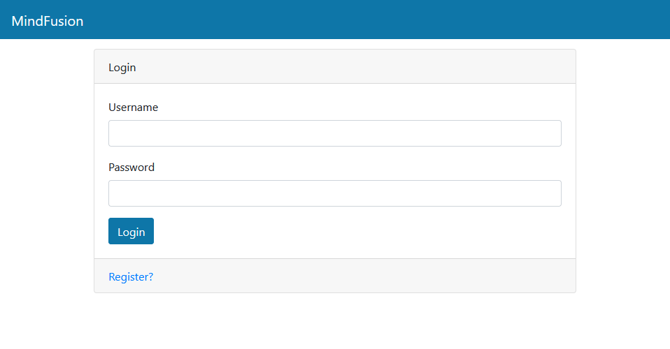
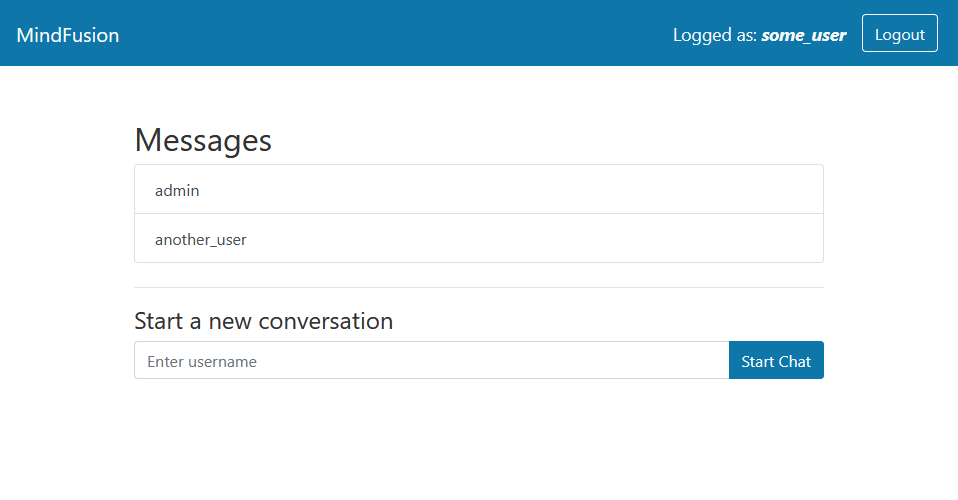
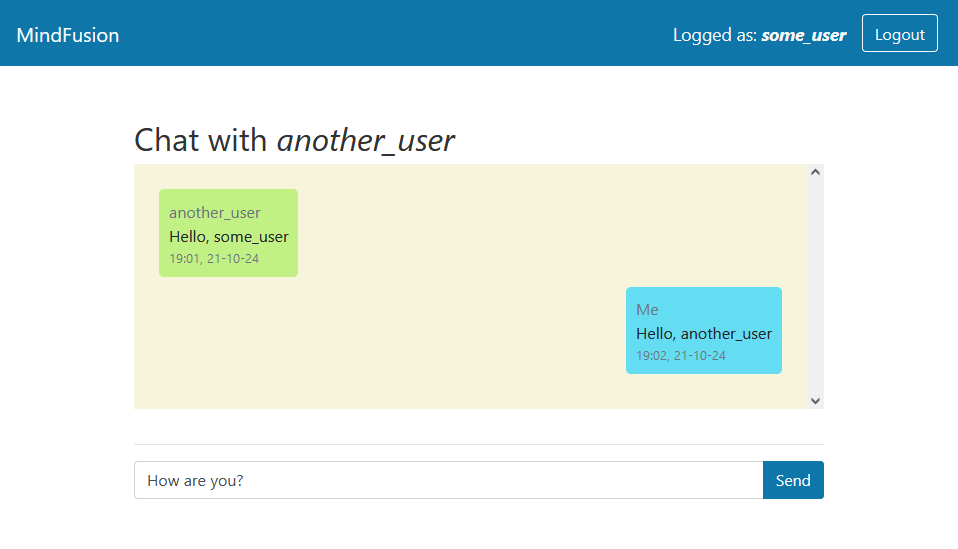

# FastAPI online chat


Данный репозиторий представляет собой приложение для обмена сообщениями между пользователями в режиме реального времени. Инструкции по запуску приложения расположены [внизу](#инструкции-по-запуску).


При переходе по адресу `/` (относительно адреса развернутого приложения, например `localhost/`) мы попадаем на форму авторизации. Если аккаунта еще нет, нужно зарегистрироваться, нажав на кнопку *Register* внизу формы. Данные о сессии хранятся в JWT в файлах cookie.


Авторизовавшись, мы попадаем на экран, где можно выбрать одного из пользователей, с которым мы уже общались, а также написать любому другому пользователю, введя его имя.


Выбрав пользователя, мы можем начать переписку с ним в режиме реального времени. Если пользователь не в сети, и при регистрации он указал ссылку на свой телеграм, бот отправит ему уведомление о новом сообщении. Однако, для этого нужно, чтобы пользователь перешел к нашему боту и выполнил команду `/start`, тем самым дав боту разрешение на отправку сообщений.



## Использованные технологии

Для реализации приложения использовались следующие технологии:

- Основное приложение:
    - FastAPI
    - SQLAlchemy
    - PostgreSQL
    - Alembic
    - WebSockets
    - Jinja2
- Выполнение отложенных задач:
    - Celery
    - Redis
- Развертывание:
    - Docker
    - Nginx


## Инструкции по запуску

Перед запуском программы необходимо указать недостающие параметры в файле `.env`:
- `JWT_SECRET_KEY` - можно использовать любую строку, например, `jwt_secret_key`
- `TELEGRAM_BOT_TOKEN` - токен вашего бота для уведомлений. Для создания бота нужно обратиться к [BotFather](https://t.me/BotFather).

Для запуска программы нужно выполнить одну команду:
```shell
docker-compose up --build
```

Эта команда запустит 5 контейнеров:
- `web`: основное приложение на FastAPI
- `celery`: celery worker для выполнения отложенных задач
- `redis`: брокер для celery
- `db`: база данных для хранения информации о пользователях и сообщениях
- `nginx`: конфигурация обратного проксирования
